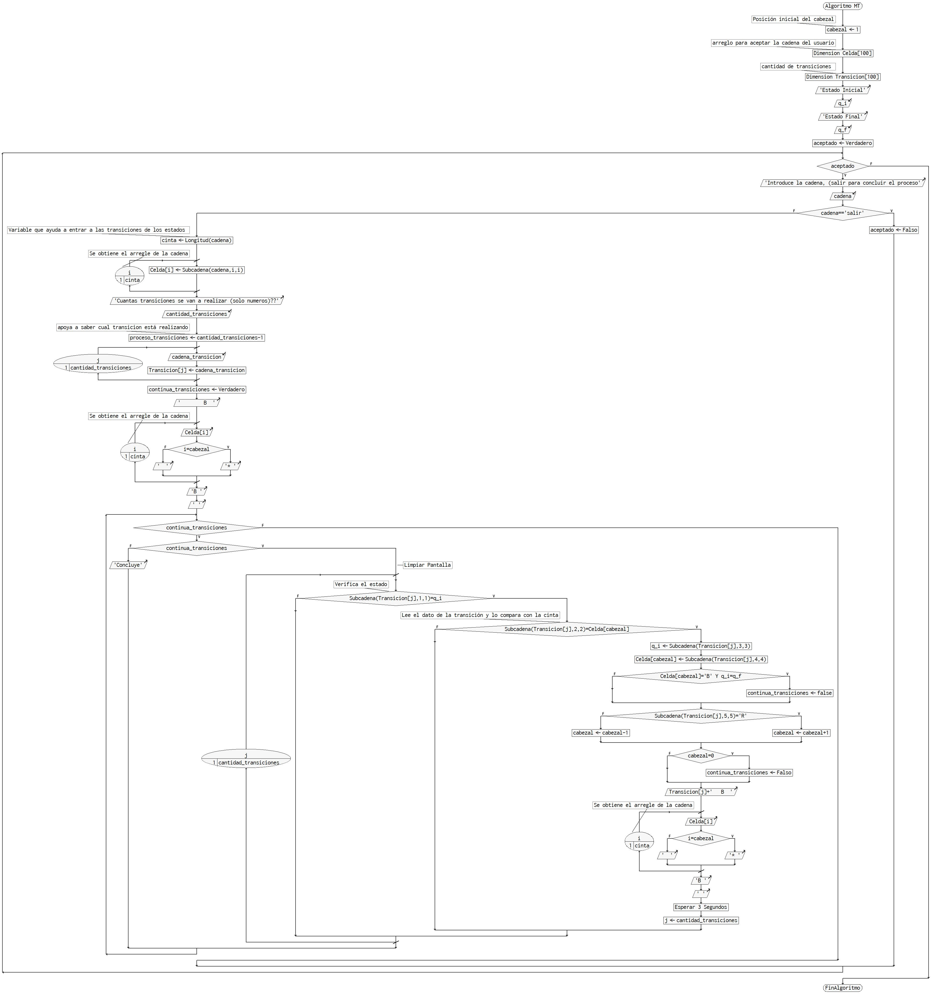

# newProject

This repository is just a playbox to me. It's just for practice :) 

## Table of contents
* [General info](#general-info) 
* [Technologies](#technologies)
* [Setup](#setup)

## General info
This should be working

## Technologies
Git, VSCode

## Setup

